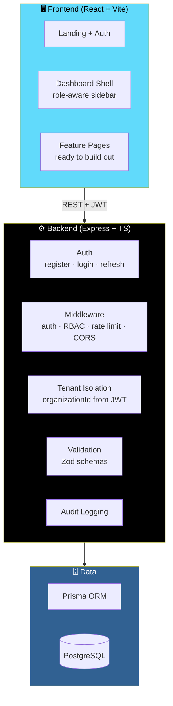

# 🏗️ BuildFlow

<div align="center">


**Construction project management SaaS.**

*Client → Project → Estimate → Tasks → Workers → Materials → Expenses → Progress → Invoice → Payment → Completion*

[✨ What's Built](#-whats-built-phase-1--foundation) • [🏗️ Architecture](#-architecture) • [🚀 Running Locally](#-running-locally) • [🗺️ Roadmap](#-not-yet-built)

</div>

---

## 📖 Overview

**BuildFlow** is a construction project management SaaS — covering the entire project lifecycle from client to completion.

### The Full Lifecycle

```mermaid
flowchart LR
    Client["👤 Client"] --> Project["🏗️ Project"]
    Project --> Estimate["📋 Estimate"]
    Estimate --> Tasks["✅ Tasks"]
    Tasks --> Workers["👷 Workers"]
    Workers --> Materials["📦 Materials"]
    Materials --> Expenses["💰 Expenses"]
    Expenses --> Progress["📈 Progress"]
    Progress --> Invoice["🧾 Invoice"]
    Invoice --> Payment["💳 Payment"]
    Payment --> Complete["🎉 Completion"]

    style Client fill:#61DAFB,color:#000
    style Project fill:#22C55E,color:#fff
    style Estimate fill:#8B5CF6,color:#fff
    style Tasks fill:#FFB454,color:#000
    style Workers fill:#0EA5E9,color:#fff
    style Materials fill:#FF6B6B,color:#fff
    style Expenses fill:#FFD700,color:#000
    style Progress fill:#0f3460,color:#fff
    style Invoice fill:#4CAF50,color:#fff
    style Payment fill:#000,color:#fff
    style Complete fill:#22C55E,color:#fff
```



### Core Idea

> **Multi-tenant from the first line of code.**
>
> `organizationId` is derived server-side from the verified JWT on every request — **never** trusted from the client. No amount of client tampering can cross an organization boundary.

---

## ✅ What's Built (Phase 1 — Foundation)

<div align="center">

| 🗄️ Full Database Schema | 🔐 Complete Auth Flow |
|:---:|:---:|
| Every model in the spec — from organizations to subscriptions | Register · login · refresh · logout · forgot/reset password |
| **🏢 Multi-Tenant Isolation** | **🛡️ RBAC for Six Roles** |
| `organizationId` derived server-side, never trusted from the client | Owner · Project Manager · Site Supervisor · Accountant · Worker · Client |
| **🔒 Security Hardened** | **🎨 Frontend Shell** |
| Helmet · CORS allow-list · rate limiting · bcrypt · Zod · audit logging | Landing page · auth pages · onboarding · dashboard shell |

</div>

### 🗄️ Database

**Full Prisma schema** covering **every model in the spec** (`prisma/schema.prisma`):

| Category | Models |
|----------|--------|
| **Identity & Tenancy** | Organizations · users/roles |
| **Projects** | Clients · projects · phases · tasks · milestones |
| **Workforce** | Workers/teams |
| **Supply Chain** | Materials/inventory · suppliers · equipment |
| **Financials** | Estimates · budgets · expenses · invoices · payments |
| **Operations** | Site reports · documents/photos |
| **Platform** | Notifications · audit logs · subscriptions |

### ⚙️ Backend (`backend/`)

**Express + TypeScript API.**

#### 🔐 Authentication

- **Register** — bootstraps an org + default roles
- **Login**
- **Refresh** — rotating refresh tokens
- **Logout**
- **Forgot / reset password**

#### 🏢 Multi-Tenant Isolation

> **`organizationId` is derived server-side from the verified JWT on every request — never trusted from the client.**

#### 🛡️ RBAC Middleware

Six roles, enforced at the route level:

| Role | Access Level |
|------|--------------|
| **Owner** | Full access |
| **Project Manager** | Project-level management |
| **Site Supervisor** | Site operations |
| **Accountant** | Financial operations |
| **Worker** | Assigned work |
| **Client** | Read-only portal |

#### 🔒 Security

| Protection | Implementation |
|-----------|---------------|
| **Helmet** | Security headers |
| **CORS** | Allow-list |
| **Rate limiting** | Global + **tighter on auth routes** |
| **Password hashing** | bcrypt |
| **Input validation** | Zod |
| **Audit logging** | Every sensitive operation |

#### 📋 Additional Endpoints

- **Organization settings**
- **Onboarding-checklist** endpoints

### 🎨 Frontend (`frontend/`)

**React + TypeScript + Vite + Tailwind.**

#### ✅ Fully Built

- **Landing page** — hero, features, client-portal preview, pricing, FAQ
- **Login / register / forgot-password**
- **Onboarding checklist**
- **Protected dashboard shell:**
  - Role-aware sidebar
  - Topbar search
  - Dashboard overview — project/financial overview, alerts, today's work

#### 🚧 Placeholder Routes *(wired into routing and sidebar)*

| Route | Status |
|-------|--------|
| **Projects** | 📋 Ready to build out |
| **Clients** | 📋 Ready to build out |
| **Workers** | 📋 Ready to build out |
| **Materials** | 📋 Ready to build out |
| **Equipment** | 📋 Ready to build out |
| **Estimates** | 📋 Ready to build out |
| **Expenses** | 📋 Ready to build out |
| **Invoices** | 📋 Ready to build out |
| **Reports** | 📋 Ready to build out |
| **Settings** | 📋 Ready to build out |

---

## 🏗️ Architecture



### Design Principles

- **Multi-tenant by construction** — `organizationId` never comes from the client
- **RBAC at the route level** — every endpoint declares its permitted roles
- **Every sensitive action is audited** — the schema is ready from day one
- **Placeholder routes are real routes** — they're wired into routing and the sidebar, ready to be filled in module by module

---

## 🚀 Running Locally

### 1. Database

```bash
docker compose up -d postgres
```

### 2. Backend

```bash
cd backend
cp .env.example .env   # edit DATABASE_URL/secrets if needed
npm install
npm run prisma:migrate
npm run dev             # http://localhost:4000
```

### 3. Frontend

```bash
cd ../frontend
npm install
npm run dev              # http://localhost:5173
```

---

## 🗺️ Not Yet Built

> **Everything from Phase 2 onward.**
>
> The schema and auth/RBAC foundation are in place so these can be added **module by module**.

<div align="center">

| Module | What's Missing |
|--------|---------------|
| **Projects & Tasks** | Full CRUD, kanban board, task assignments |
| **Materials & Inventory** | Inventory transactions, stock tracking |
| **Estimates** | Estimate-to-project conversion |
| **Budgets** | Budget creation, tracking, variance analysis |
| **Expenses** | Expense recording and approval flows |
| **Daily Site Reports** | Report creation, photo uploads, weather |
| **Invoicing & Payments** | Invoice generation, payment processing |
| **Client Portal** | Client-facing project view |
| **Notifications** | In-app and email delivery |
| **Reports & Analytics** | Dashboards, exports, cost analysis |

</div>

---

## 🗺️ Roadmap

### ✅ Phase 1 — Foundation

- [x] Full Prisma schema covering every model in the spec
- [x] Auth: register, login, refresh, logout, forgot/reset password
- [x] Rotating refresh tokens
- [x] Multi-tenant isolation with server-derived `organizationId`
- [x] RBAC middleware for six roles
- [x] Helmet, CORS allow-list, rate limiting (tighter on auth)
- [x] bcrypt password hashing
- [x] Zod input validation
- [x] Audit logging
- [x] Organization settings endpoints
- [x] Onboarding-checklist endpoints
- [x] Landing page with hero, features, pricing, FAQ
- [x] Login / register / forgot-password pages
- [x] Onboarding checklist UI
- [x] Protected dashboard shell with role-aware sidebar
- [x] Topbar search
- [x] Dashboard overview with alerts and today's work
- [x] Placeholder routes wired into routing and sidebar

### 🔜 Phase 2+

- [ ] Projects CRUD + Kanban board
- [ ] Clients management
- [ ] Workers and teams
- [ ] Materials and inventory transactions
- [ ] Equipment tracking
- [ ] Estimates → project conversion
- [ ] Budgets and variance analysis
- [ ] Expenses and approvals
- [ ] Daily site reports with photo uploads
- [ ] Invoicing and payment processing
- [ ] Client portal
- [ ] Notifications (in-app + email)
- [ ] Reports and analytics
- [ ] Subscriptions and billing

---

## 🤝 Contributing

Contributions are welcome. Please:

1. Fork the repository
2. **Never trust `organizationId` from the client** — always derive it from the verified JWT
3. **Declare role requirements at the route level** — RBAC is not optional
4. **Validate every request body** with Zod
5. **Log every sensitive action** to the audit trail
6. **Keep the schema as the source of truth** — models already exist for later phases
7. Submit a Pull Request

### Guidelines

- **Never trust a client-supplied tenant id** — multi-tenancy is not negotiable
- **Never skip RBAC on a route** — even read-only routes
- **Never trust a client-supplied refresh token** — rotate on every use
- **Never bypass the audit log** for sensitive operations
- **Never hard-delete** where the schema expects soft-delete

---

## 📜 License

MIT — see [LICENSE](LICENSE) for details.

---

## 🙏 Acknowledgments

- **Prisma** — for making the full construction domain model tangible
- **Zod** — for validation that reads like documentation
- **Every project manager who's ever chased a missing invoice** — this is for you

---

<div align="center">

### 🏗️ PLAN. BUILD. INVOICE. GET PAID.

**Multi-tenant from the first line of code.**

**`organizationId` never comes from the client.**

<br>

⭐ If this project helped you, consider giving it a star.

<br>

[⬆ Back to Top](#️-buildflow)

</div>
